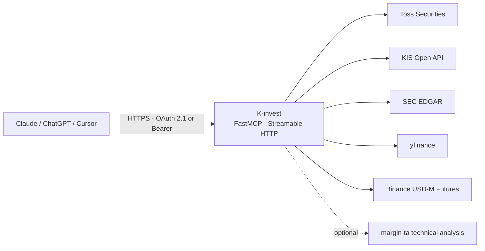

# K-invest

> A read-only MCP server that knows your brokerage accounts — bringing personal investment context to web LLMs

[한국어](README.md) · [MIT License](LICENSE) · Python 3.10+ · 

Web LLMs like ChatGPT, Claude, and Perplexity don't know your accounts, holdings, or
trade history. K-invest bundles **Toss Securities, Korea Investment Securities (KIS),
SEC EDGAR, yfinance, and Binance USD-M Futures** into a single MCP (Model Context
Protocol) server, so an LLM can answer questions by querying your investment data —
read-only.

**There are no order create/modify/cancel tools.** Every endpoint is read-only.

## Architecture



## Quick Start

### Option 1 — clone & run

```bash
git clone https://github.com/ianlyoo/K-invest && cd K-invest
pip install -r requirements.txt
cp .env.example .env   # fill in MCP_AUTH_TOKEN and provider credentials
python3 server.py      # starts on 127.0.0.1:8100
```

### Option 2 — pip install

```bash
pip install git+https://github.com/ianlyoo/K-invest   # install into a venv/pipx/uv, not system Python
k-invest
```

> This is a flat-module package, so top-level module names (`server`, etc.) get installed as-is. Always install into an isolated virtual environment.

Providers can be **partially configured**. The server starts up with only Toss
configured; tools for an unconfigured provider return an error envelope such as
`KIS_NOT_CONFIGURED`.

## Tool Catalog

### Quotes / market data

| Tool | Description |
|------|------|
| `get_quote(symbol)` | Toss current price |
| `get_orderbook(symbol)` | Toss order book |
| `get_recent_trades(symbol)` | Toss recent market trades |
| `get_price_limits(symbol)` | Upper/lower price limits. Interpret the response's reference date/session alongside the provider field. |
| `get_candles(symbol, interval="1d", count=100)` | `1d` or `1m` candles |
| `get_stock_info(symbol)` | Basic stock info |
| `get_stock_warnings(symbol)` | Buy-caution notices |
| `get_exchange_rate(base="USD", quote="KRW")` | FX rate |
| `get_market_hours(market="US"|"KR")` | Market trading hours |
| `get_kis_domestic_quote(symbol)` | KIS domestic (Korea) quote |
| `get_kis_overseas_quote(symbol, exchange)` | KIS overseas quote. Japan accepts `TKSE`/`TSE`; the internal KIS code used is `TSE`. |
| `compare_quotes(symbol, exchange="NASDAQ")` | Toss/KIS quote comparison with provider warnings |

### Crypto futures data

Uses only Binance USD-M Futures public market-data endpoints. No API key required, and no order/leverage/margin/transfer functionality is exposed.

| Tool | Description |
|------|------|
| `get_binance_futures_quote(symbol)` | Latest futures price. E.g. `BTCUSDT`, `ETHUSDT` |
| `get_binance_futures_mark_price(symbol)` | Mark price, index price, latest funding rate |
| `get_binance_funding_rate(symbol, limit=10)` | Funding-rate history, includes `funding_rate_pct` |
| `get_binance_open_interest(symbol, history=false, period="1h", limit=30)` | Current open interest, or up to a month of history |
| `get_binance_futures_candles(symbol, interval="1h", count=100, price_type="last")` | Futures candles keyed on last price or mark price |
| `get_crypto_futures_snapshot(symbol)` | Summary of price, mark/index, funding rate, and open interest |

Example `get_crypto_futures_snapshot("BTCUSDT")`:

```json
{
  "symbol": "BTCUSDT",
  "market": "binance_usd_m_futures",
  "auth_required": false,
  "quote": {"price": 60000.5},
  "mark": {"mark_price": 60010.25, "last_funding_rate_pct": 0.01},
  "funding_rates": [{"funding_rate_pct": 0.01}],
  "open_interest": {"open_interest": 123.45},
  "open_interest_notional": 7408265.3625
}
```

### Accounts / portfolio

| Tool | Description |
|------|------|
| `get_toss_accounts()` | List of configured Toss account labels. Never returns credential values. |
| `get_toss_holdings(symbol="", account="primary")` | Toss holdings. `account` is `primary`, `secondary`, or `all` |
| `get_toss_buying_power(currency="USD"|"KRW", account="primary")` | Toss buying power. `account="all"` supported |
| `get_toss_trade_history(limit=50, account="primary")` | Toss recent trade history. `account="all"` supported |
| `get_kis_domestic_balance()` | KIS domestic (Korea) balance |
| `get_kis_overseas_balance()` | KIS overseas balance |
| `get_kis_trade_history(start_date, end_date)` | KIS trade history |
| `get_kis_cash_balance()` | KIS cash balance |
| `get_portfolio_risk(detail_level="summary")` | Best-effort aggregation of Toss/KIS holdings into per-currency exposure and concentration risk |

### Financials / filings

| Tool | Description |
|------|------|
| `get_financials(symbol)` | yfinance financial statements/valuation. Ratios are suffixed `_pct`; periods are labeled with `period_type`/`period_end`. |
| `get_key_metrics(symbol)` | Core valuation/profitability/growth metrics. Includes yfinance forward EPS/revenue estimates, target price, and recommendation consensus. |
| `get_sec_financials(symbol)` | SEC CompanyFacts 10-K annuals + 10-Q quarters + trailing-4-quarter TTM |
| `get_ttm_financials(symbol)` | TTM summary derived from SEC 10-Q/FY data, plus a list of recent quarters |
| `get_insider_trades(symbol, days_back=180, detail_level="summary")` | SEC Form 4 insider trades. Summarized/aggregated by default; raw lots included only at `full` |
| `get_risk_free_rate()` | 10-Year US Treasury yield from yfinance `^TNX` |

Example `get_sec_financials` SEC extension block:

```json
{
  "quarters": [{"fiscal_year": 2026, "fiscal_period": "Q2", "revenue": {"value": 10599000000}}],
  "ttm": {
    "period_type": "TTM",
    "revenue": {"value": 44487000000},
    "operating_income": {"value": 11355000000},
    "operating_cash_flow": {"value": 14285000000},
    "capex": {"value": 1783000000},
    "free_cash_flow": {"value": 12502000000}
  },
  "segment_revenue": {
    "latest_quarter": [
      {"segment": "qct", "value": 9076000000},
      {"segment": "qtl", "value": 1382000000},
      {"segment": "handsets", "value": 6024000000}
    ]
  },
  "annuals": [{"earnings_quality": {"normalization_flags": ["high_effective_tax_rate"]}}]
}
```

Example `get_key_metrics` consensus:

```json
{
  "analyst_consensus": {
    "forward_eps": 10.9653,
    "target_price": {"mean": 215.42, "median": 220.0},
    "recommendation": {"key": "hold", "mean": 2.51},
    "revenue_estimate": {"+1y": {"avg": 43579002120, "growth_pct": 2.37}}
  }
}
```

### Technical analysis

| Tool | Description |
|------|------|
| `analyze_technical(symbol, market="auto", detail_level="summary")` | Full margin-ta analysis summary |
| `get_entry_plan(symbol, market="auto", detail_level="summary")` | Recommended entry strategy / stop-loss / target price |
| `scan_top_stocks(top_n=5, min_score=0)` | NASDAQ100 + S&P500 technical scanner, via margin-ta `scan_nightly.py --json` |

Optional feature: with `MARGIN_TA_HOME` unset, these return a `MARGIN_TA_NOT_CONFIGURED` error.

For Korean stocks, margin-ta rounds entry/stop/target prices to the KRW tick size. `entry_tranche_pct` is a tactical entry tranche size, not a recommended overall portfolio weight. When the risk:reward ratio at the first target is low, quality/confidence are lowered and a warning is returned.

### Composite / operational tools

| Tool | Description |
|------|------|
| `get_stock_snapshot(symbol, market="auto")` | One-shot bundle of quote comparison, key metrics, insider summary, and technical entry plan |
| `get_portfolio_risk(detail_level="summary")` | Portfolio currency exposure / concentration risk |
| `health_check()` | Lightweight status check across Toss/KIS/SEC/yfinance/margin-ta |
| `get_invest_mcp_help(topic="overview")` | Usage guide for LLMs |

## Internet Exposure (HTTPS)

MCP connectors require HTTPS. If you only have a static IP, you can expose the
server without a domain using [sslip.io](https://sslip.io) and Caddy:

```caddyfile
# /etc/caddy/Caddyfile — replace <your-ip> with your server's public IP
<your-ip>.sslip.io {
    reverse_proxy 127.0.0.1:8100
}
```

Set `MCP_PUBLIC_URL=https://<your-ip>.sslip.io` in `.env` (the DNS-rebinding
protection allowlist is derived from this value).

## Connecting LLM Clients

Two auth methods work **at the same time**. Pick whichever your client's UI asks for.

### Option A — OAuth 2.1 (clients with Client ID / Secret fields)

Most connector UIs (ChatGPT, Claude, Cursor) use this. You pre-register one client
pair on the server and enter those values in the connector; the client then runs the
standard authorization-code flow with PKCE.

```bash
# Generate the pair, then put it in .env (or your systemd env)
python3 -c "import secrets; print('MCP_OAUTH_CLIENT_ID=k-invest-' + secrets.token_hex(8)); print('MCP_OAUTH_CLIENT_SECRET=' + secrets.token_urlsafe(32))"
```

What to enter in the connector:

| Field | Value |
|---|---|
| URL | your public URL plus `/mcp` (`https://<your-ip>.sslip.io` + `/mcp`) |
| Client ID | the `MCP_OAUTH_CLIENT_ID` value |
| Client Secret | the `MCP_OAUTH_CLIENT_SECRET` value |

OAuth turns on only when **both** `MCP_OAUTH_CLIENT_ID` and `MCP_OAUTH_CLIENT_SECRET`
are set. It then serves `/.well-known/oauth-authorization-server`, `/authorize`, and
`/token`. Dynamic client registration (`/register`) is deliberately disabled, so nobody
can self-issue a client and bypass the secret.

### Option B — Static bearer token (when you set the Authorization header yourself)

Use this for Claude's custom-connector Authorization field, a local MCP client's
`headers` config, or scripts/curl: send `Authorization: Bearer <MCP_AUTH_TOKEN>`.
This path keeps working even with OAuth enabled.

## Configuration Reference

| Env var | Required | Description |
|---|---|---|
| `MCP_AUTH_TOKEN` | ✅ | Bearer token. Generate with `openssl rand -hex 32` |
| `MCP_PUBLIC_URL` |  | Externally reachable URL (default `http://127.0.0.1:8100`) |
| `MCP_OAUTH_CLIENT_ID` / `MCP_OAUTH_CLIENT_SECRET` |  | OAuth 2.1 client (both set = OAuth enabled — Option A) |
| `MCP_OAUTH_TOKEN_TTL` |  | Access-token lifetime in seconds (default 3600) |
| `TOSS_CLIENT_ID` / `TOSS_CLIENT_SECRET` | ✅* | Toss Securities Open API — Toss WTS → Settings → Open API (설정 → Open API) |
| `TOSS_CREDS_FILE` |  | Multi-account JSON (`{"accounts": [...]}`, chmod 600) |
| `KIS_APP_KEY` / `KIS_APP_SECRET` |  | KIS Open API ([issuance](https://apiportal.koreainvestment.com)) |
| `KIS_CANO` / `KIS_ACNT_PRDT_CD` |  | KIS account number (8 digits) / product code (2 digits) |
| `KIS_ENV_FILE` |  | Reuse an existing env file containing APP_KEY, etc. |
| `SEC_USER_AGENT` |  | SEC-recommended User-Agent — include a reachable email |
| `MARGIN_TA_HOME` |  | Path to a margin-ta checkout (enables the 3 technical-analysis tools) |
| `KINVEST_CACHE_DIR` |  | Token cache directory (default `~/.cache/k-invest`) |

\* At least one of Toss or KIS. The rest are optional.

## Response Contract

Every tool returns an `{ok, data, error, meta}` envelope:

```json
{"ok": true, "data": {...}, "error": null,
 "meta": {"server_version": "2.0.0", "provider": "toss"}}
```

On failure, `error.code` (`KIS_NOT_CONFIGURED`, `UPSTREAM_TOSS_ERROR`, etc.),
`provider`, and `retryable` are populated. Price differences between providers can
be normal — exchange, session, and delay all vary — and `compare_quotes`-style
tools call this out via warning fields.

## Security

- **READ-ONLY invariant**: order-related tools are never registered. Not even via PR.
- Credentials are injected only via env/files and never appear in responses. Credential files should be `chmod 600`.
- The server refuses to start without `MCP_AUTH_TOKEN`.
- When exposed to the internet: use a strong token, HTTPS is mandatory, and never expose port 8100 directly through the firewall (reverse proxy only).

### What to know before enabling OAuth

This server's OAuth is **single-user**, so `/authorize` auto-approves without a consent
screen. Anyone who knows the server URL and the client_id can therefore obtain an
authorization code — **the real gate is `client_secret`**: exchanging a code at `/token`
requires the secret (and PKCE is verified alongside it), and no token is issued without it.

- Treat `MCP_OAUTH_CLIENT_SECRET` like an account password; never expose it outside the connector.
- Codes are single-use, expire in 10 minutes, and are bound to the client_id and redirect_uri.
- Access tokens expire after `MCP_OAUTH_TOKEN_TTL` (default 1 hour). Codes and tokens live
  only in memory, so restarting the server invalidates them all (your kill switch if one leaks).
- Dynamic client registration (`/register`) is explicitly disabled in code.

## Running as a systemd service (optional)

Replace the placeholders (`youruser`, etc.) in the `deploy/k-invest.service`
template, install it under `/etc/systemd/system/`, and keep env vars in
`/etc/k-invest.env`.

## margin-ta (optional)

`analyze_technical`/`get_entry_plan`/`scan_top_stocks` require a local checkout of
the separate technical-analysis engine [margin-ta] (`MARGIN_TA_HOME`). **margin-ta
is planned to be open-sourced as a separate repo soon**; until then, these 3 tools
are an optional feature.

## Development

```bash
python3 -m pytest tests/   # run tests
ruff check .                # lint
```

## Disclaimer

All output is supplementary data for investment decisions, not trading advice.
There is no guarantee of data accuracy or timeliness, and any losses from its use
are the user's responsibility.

## License

[MIT](LICENSE) © 2026 AhnRyu
