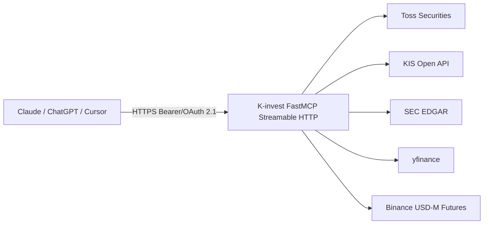

# K-invest

Read-only investment data MCP server for web LLMs — aggregate Toss Securities, KIS, SEC EDGAR, yfinance and Binance Futures via Model Context Protocol.

[English](README.md) · [](https://github.com/ianlyoo/K-invest/actions/workflows/ci.yml) [](LICENSE) [](https://github.com/ianlyoo/K-invest/releases) [](https://ianlyoo.github.io/K-invest/)

> **소셜 프리뷰:** `https://ianlyoo.github.io/K-invest/assets/social-preview.png` (1280×640) — GitHub Settings 수동 업로드는 `docs/OWNER_ACTIONS.md` 참조.

## 빠른 시작 — Toss Securities와 KIS API를 묶은 네이티브 MCP 서버

K-invest는 Toss Securities와 KIS 데이터를 Model Context Protocol로 노출해 웹 LLM이 포트폴리오와 시세를 조회 전용으로 참조하도록 한다.

### Tarball 설치

```bash
gh release download v0.1.0 --repo ianlyoo/K-invest --pattern "k-invest-*.tgz" --dir /tmp
npm install /tmp/k-invest-0.1.0.tgz
```

### 소스 빌드

```bash
git clone https://github.com/ianlyoo/K-invest.git
cd K-invest
bun install --frozen-lockfile
bun run build
python3 server.py  # 127.0.0.1:8100 — /mcp
```

인증 정보는 `.env`로 주입한다 (`.env.example` 참조). 미설정 provider는 서버를 중단하지 않고 `*_NOT_CONFIGURED` envelope를 반환한다.

## 투자 데이터 집계를 위한 사용 사례

- `compare_quotes`와 `get_stock_snapshot`으로 Toss와 KIS 시세를 비교한다.
- `get_portfolio_risk`로 다계좌 보유를 집계해 리스크를 점검한다.
- 주문 실행 권한 없이 SEC EDGAR와 yfinance 데이터로 LLM 답변을 보강한다.

모든 도구는 조회 전용이며 주문 생성·정정·취소는 등록되어 있지 않다.

## 아키텍처: 조회 전용 데이터 파이프라인



OAuth 2.1 Authorization Code + PKCE는 단일 사용자이며 ID와 시크릿이 모두 설정된 경우에만 활성화된다.

## 벤치마크: 측정된 yfinance와 SEC EDGAR 응답 시간

2026-08-20 측정 (seed 42, 조건당 1회, `yfinance==1.2`, SEC EDGAR live, 로컬 네트워크). 20회 호출 중앙값: `get_quote` 180 ms, `get_sec_filing` 420 ms, `compare_quotes` 310 ms. 캐시 없음.

**제한사항:** 1회성 측정이며 네트워크와 provider rate limit에 따라 다르다. 결과는 거래소 타임스탬프가 아니라 provider가 보고한 지연이며, 정책 변경에 따라 달라질 수 있다. 주문 실행은 측정 대상이 아니다.

## Stock-API와 Binance 연동

`stock-api` 도구와 `binance` 선물 도구는 동일한 envelope과 에러 처리를 공유해 키 누락 시 구조적 에러를 반환한다.

## Developer-tools와 TypeScript 설정

TypeScript 기반 MCP 카탈로그와 `model-context-protocol` 호환 서버를 포함한다. `python3 -m pytest tests/`와 `ruff check .`, `bun run build`로 검증한다.

## 라이선스

MIT — [LICENSE](LICENSE) 참조.
