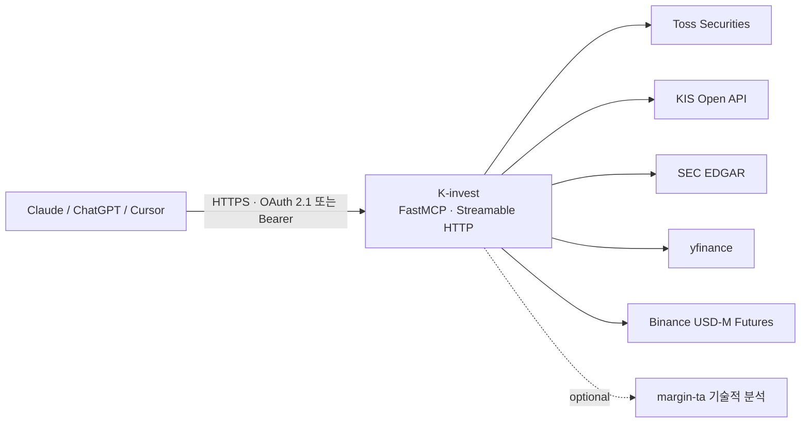

# K-invest

> 내 증권 계좌를 아는 read-only MCP 서버 — 웹 LLM에 개인 투자 컨텍스트를 연결한다

[English](README.en.md) · [MIT License](LICENSE) · Python 3.10+ · 

ChatGPT, Claude, Perplexity 같은 웹 LLM은 내 계좌·보유 종목·매매 내역을 모른다.
K-invest는 **토스증권, 한국투자증권(KIS), SEC EDGAR, yfinance, Binance USD-M 선물**을
하나의 MCP(Model Context Protocol) 서버로 묶어, LLM이 내 투자 데이터를 조회 전용으로
참조하며 답하게 만든다.

**주문 생성·정정·취소 도구는 없다.** 모든 엔드포인트가 read-only다.

## 아키텍처



## 빠른 시작

### 방법 1 — clone & run

```bash
git clone https://github.com/ianlyoo/K-invest && cd K-invest
pip install -r requirements.txt
cp .env.example .env   # MCP_AUTH_TOKEN과 provider credential 채우기
python3 server.py      # 127.0.0.1:8100 에서 기동
```

### 방법 2 — pip 설치

```bash
pip install git+https://github.com/ianlyoo/K-invest   # venv/pipx/uv 격리 설치 권장
k-invest
```

> flat 모듈 패키징이라 최상위 모듈명(`server` 등)이 설치된다. 반드시 가상환경에 설치할 것.

provider는 **부분 설정이 가능하다**. Toss만 설정해도 서버는 뜨고, 미설정 provider의
도구는 `KIS_NOT_CONFIGURED` 같은 에러 envelope을 반환한다.

## 도구 카탈로그

### 시세/시장 데이터

| 도구 | 설명 |
|------|------|
| `get_quote(symbol)` | 토스 현재가 |
| `get_orderbook(symbol)` | 토스 호가 |
| `get_recent_trades(symbol)` | 토스 최근 시장 체결 |
| `get_price_limits(symbol)` | 상/하한가. 응답의 기준일/세션은 provider 필드와 함께 해석해야 합니다. |
| `get_candles(symbol, interval="1d", count=100)` | `1d` 또는 `1m` 캔들 |
| `get_stock_info(symbol)` | 종목 기본 정보 |
| `get_stock_warnings(symbol)` | 매수 유의사항 |
| `get_exchange_rate(base="USD", quote="KRW")` | 환율 |
| `get_market_hours(market="US"|"KR")` | 장 운영시간 |
| `get_kis_domestic_quote(symbol)` | KIS 국내 시세 |
| `get_kis_overseas_quote(symbol, exchange)` | KIS 해외 시세. 일본은 `TKSE`/`TSE`를 허용하고 내부 KIS 코드는 `TSE`를 사용합니다. |
| `compare_quotes(symbol, exchange="NASDAQ")` | 토스/KIS 시세 비교와 provider 경고 |

### 암호화폐 선물 데이터

Binance USD-M Futures 공개 market-data 엔드포인트만 사용합니다. API 키가 필요 없고, 주문/레버리지/마진/이체 기능은 노출하지 않습니다.

| 도구 | 설명 |
|------|------|
| `get_binance_futures_quote(symbol)` | 최신 선물 가격. 예: `BTCUSDT`, `ETHUSDT` |
| `get_binance_futures_mark_price(symbol)` | mark price, index price, latest funding rate |
| `get_binance_funding_rate(symbol, limit=10)` | 펀딩비 히스토리. `funding_rate_pct` 포함 |
| `get_binance_open_interest(symbol, history=false, period="1h", limit=30)` | 현재 open interest 또는 최근 1개월 범위 히스토리 |
| `get_binance_futures_candles(symbol, interval="1h", count=100, price_type="last")` | last price 또는 mark price 기준 선물 캔들 |
| `get_crypto_futures_snapshot(symbol)` | 가격, mark/index, 펀딩비, open interest 요약 |

`get_crypto_futures_snapshot("BTCUSDT")` 예시:

```json
{
  "symbol": "BTCUSDT",
  "market": "binance_usd_m_futures",
  "auth_required": false,
  "quote": {"price": 60000.5},
  "mark": {"mark_price": 60010.25, "last_funding_rate_pct": 0.01},
  "funding_rates": [{"funding_rate_pct": 0.01}],
  "open_interest": {"open_interest": 123.45},
  "open_interest_notional": 7408265.3625
}
```

### 계좌/포트폴리오 조회

| 도구 | 설명 |
|------|------|
| `get_toss_accounts()` | 설정된 토스 계좌 label 목록. credential 값은 반환하지 않습니다. |
| `get_toss_holdings(symbol="", account="primary")` | 토스 보유 종목. `account`는 `primary`, `secondary`, `all` |
| `get_toss_buying_power(currency="USD"|"KRW", account="primary")` | 토스 매수 가능 금액. `account="all"` 지원 |
| `get_toss_trade_history(limit=50, account="primary")` | 토스 최근 체결 내역. `account="all"` 지원 |
| `get_kis_domestic_balance()` | KIS 국내 잔고 |
| `get_kis_overseas_balance()` | KIS 해외 잔고 |
| `get_kis_trade_history(start_date, end_date)` | KIS 체결 내역 |
| `get_kis_cash_balance()` | KIS 현금 잔고 |
| `get_portfolio_risk(detail_level="summary")` | 토스/KIS 보유종목을 best-effort로 모아 통화별 노출과 집중도 리스크를 계산 |

### 재무/공시

| 도구 | 설명 |
|------|------|
| `get_financials(symbol)` | yfinance 재무제표/밸류에이션. 비율은 `_pct`, 기간은 `period_type`/`period_end`로 표기합니다. |
| `get_key_metrics(symbol)` | 주요 밸류에이션/수익성/성장률 지표. yfinance 포워드 EPS/매출 추정, 목표가, 추천 컨센서스를 포함합니다. |
| `get_sec_financials(symbol)` | SEC CompanyFacts 10-K 연간 재무 + 10-Q 분기 + 최근 4개 회계분기 TTM |
| `get_ttm_financials(symbol)` | SEC 10-Q/FY 기반 TTM 요약과 최근 분기 목록 |
| `get_insider_trades(symbol, days_back=180, detail_level="summary")` | SEC Form 4 내부자 거래. 기본은 요약/집계이며 `full`에서만 raw lot을 포함합니다. |
| `get_risk_free_rate()` | yfinance `^TNX` 기반 10Y 미국채 금리 |

`get_sec_financials` SEC 확장 블록 예시:

```json
{
  "quarters": [{"fiscal_year": 2026, "fiscal_period": "Q2", "revenue": {"value": 10599000000}}],
  "ttm": {
    "period_type": "TTM",
    "revenue": {"value": 44487000000},
    "operating_income": {"value": 11355000000},
    "operating_cash_flow": {"value": 14285000000},
    "capex": {"value": 1783000000},
    "free_cash_flow": {"value": 12502000000}
  },
  "segment_revenue": {
    "latest_quarter": [
      {"segment": "qct", "value": 9076000000},
      {"segment": "qtl", "value": 1382000000},
      {"segment": "handsets", "value": 6024000000}
    ]
  },
  "annuals": [{"earnings_quality": {"normalization_flags": ["high_effective_tax_rate"]}}]
}
```

`get_key_metrics` 컨센서스 예시:

```json
{
  "analyst_consensus": {
    "forward_eps": 10.9653,
    "target_price": {"mean": 215.42, "median": 220.0},
    "recommendation": {"key": "hold", "mean": 2.51},
    "revenue_estimate": {"+1y": {"avg": 43579002120, "growth_pct": 2.37}}
  }
}
```

### 기술적 분석

| 도구 | 설명 |
|------|------|
| `analyze_technical(symbol, market="auto", detail_level="summary")` | margin-ta 전체 분석 요약 |
| `get_entry_plan(symbol, market="auto", detail_level="summary")` | 추천 진입 전략/손절/목표가 |
| `scan_top_stocks(top_n=5, min_score=0)` | NASDAQ100 + S&P500 기술적 스캐너. margin-ta `scan_nightly.py --json` 사용 |

`MARGIN_TA_HOME` 미설정 시 `MARGIN_TA_NOT_CONFIGURED` 에러를 반환하는 선택 기능입니다.

margin-ta 한국 종목은 KRW 호가 단위에 맞게 진입가/손절가/목표가를 반올림합니다. `entry_tranche_pct`는 전술적 진입 tranche 크기이며 전체 포트폴리오 비중 권고가 아닙니다. 첫 목표가 기준 R:R이 낮으면 quality/confidence를 낮추고 경고를 반환합니다.

### 복합/운영 도구

| 도구 | 설명 |
|------|------|
| `get_stock_snapshot(symbol, market="auto")` | 시세 비교, 주요 지표, 내부자 요약, 기술적 진입 계획을 한 번에 반환 |
| `get_portfolio_risk(detail_level="summary")` | 포트폴리오 통화 노출/집중도 리스크 |
| `health_check()` | 토스/KIS/SEC/yfinance/margin-ta 경량 상태 점검 |
| `get_invest_mcp_help(topic="overview")` | LLM용 사용 가이드 |

## 인터넷 노출 (HTTPS)

MCP 커넥터는 HTTPS가 필요하다. 고정 IP만 있으면 [sslip.io](https://sslip.io)와
Caddy로 도메인 없이 노출할 수 있다:

```caddyfile
# /etc/caddy/Caddyfile — <your-ip>를 서버 공인 IP로 치환
<your-ip>.sslip.io {
    reverse_proxy 127.0.0.1:8100
}
```

`.env`에 `MCP_PUBLIC_URL=https://<your-ip>.sslip.io`를 설정한다 (DNS rebinding
보호 allowlist가 이 값에서 유도된다).

## LLM 클라이언트 연결

인증은 두 방식을 **동시에** 지원한다. 클라이언트 UI가 무엇을 요구하느냐에 따라 고르면 된다.

### 방법 A — OAuth 2.1 (ID/시크릿 입력칸이 있는 클라이언트)

ChatGPT·Claude·Cursor 등 대부분의 커넥터 UI가 이 방식이다. 서버에 클라이언트 한 쌍을
미리 등록해두고, 그 값을 커넥터에 입력하면 표준 인증코드 플로우(PKCE)로 연결된다.

```bash
# 서버에 등록할 ID/시크릿 생성 → .env(또는 systemd env)에 넣는다
python3 -c "import secrets; print('MCP_OAUTH_CLIENT_ID=k-invest-' + secrets.token_hex(8)); print('MCP_OAUTH_CLIENT_SECRET=' + secrets.token_urlsafe(32))"
```

커넥터 입력값:

| 칸 | 값 |
|---|---|
| URL | 공개 URL + `/mcp` (`https://<your-ip>.sslip.io` + `/mcp`) |
| Client ID | `MCP_OAUTH_CLIENT_ID` 값 |
| Client Secret | `MCP_OAUTH_CLIENT_SECRET` 값 |

`MCP_OAUTH_CLIENT_ID`와 `MCP_OAUTH_CLIENT_SECRET`이 **둘 다** 설정돼야 OAuth가 켜진다.
켜지면 `/.well-known/oauth-authorization-server`, `/authorize`, `/token`이 노출된다.
동적 클라이언트 등록(`/register`)은 의도적으로 비활성이다 — 누구나 자기 클라이언트를
발급해 시크릿 관문을 우회하는 것을 막기 위함.

### 방법 B — 정적 Bearer 토큰 (Authorization 헤더를 직접 넣는 경우)

Claude 커스텀 커넥터의 Authorization 칸, 로컬 MCP 클라이언트의 `headers` 설정,
스크립트/curl 등에 쓴다. `MCP_AUTH_TOKEN` 값을 `Authorization: Bearer <토큰>`으로 보낸다.
OAuth를 켜도 이 경로는 계속 동작한다.

## 설정 레퍼런스

| 환경변수 | 필수 | 설명 |
|---|---|---|
| `MCP_AUTH_TOKEN` | ✅ | Bearer 토큰. `openssl rand -hex 32`로 생성 |
| `MCP_PUBLIC_URL` |  | 외부 접근 URL (기본 `http://127.0.0.1:8100`) |
| `MCP_OAUTH_CLIENT_ID` / `MCP_OAUTH_CLIENT_SECRET` |  | OAuth 2.1 클라이언트 (둘 다 설정 시 활성 — 방법 A) |
| `MCP_OAUTH_TOKEN_TTL` |  | 액세스 토큰 수명(초, 기본 3600) |
| `TOSS_CLIENT_ID` / `TOSS_CLIENT_SECRET` | ✅* | 토스증권 Open API (WTS → 설정 → Open API) |
| `TOSS_CREDS_FILE` |  | 다중 계좌 JSON (`{"accounts": [...]}`, chmod 600) |
| `KIS_APP_KEY` / `KIS_APP_SECRET` |  | KIS Open API ([발급](https://apiportal.koreainvestment.com)) |
| `KIS_CANO` / `KIS_ACNT_PRDT_CD` |  | KIS 계좌번호 8자리 / 상품코드 2자리 |
| `KIS_ENV_FILE` |  | APP_KEY 등이 든 기존 env 파일 재사용 |
| `SEC_USER_AGENT` |  | SEC 권장 UA — 연락 가능한 이메일 포함 |
| `MARGIN_TA_HOME` |  | margin-ta 체크아웃 경로 (기술적 분석 3종 활성화) |
| `KINVEST_CACHE_DIR` |  | 토큰 캐시 디렉토리 (기본 `~/.cache/k-invest`) |

\* Toss 또는 KIS 중 최소 하나. 나머지는 선택.

## 응답 규약

모든 도구는 `{ok, data, error, meta}` envelope을 반환한다:

```json
{"ok": true, "data": {...}, "error": null,
 "meta": {"server_version": "2.0.0", "provider": "toss"}}
```

실패 시 `error.code`(`KIS_NOT_CONFIGURED`, `UPSTREAM_TOSS_ERROR` 등)·`provider`·
`retryable`이 채워진다. provider 간 시세 차이는 정상일 수 있다 — 거래소·세션·지연이
달라서이며, `compare_quotes`류 도구는 경고 필드로 이를 명시한다.

## 보안

- **READ-ONLY 불변식**: 주문 관련 도구는 등록되지 않는다. PR로도 받지 않는다.
- credential은 env/파일로만 주입되고 응답에 노출되지 않는다. creds 파일은 `chmod 600`.
- MCP_AUTH_TOKEN 없이는 서버가 기동을 거부한다.
- 인터넷 노출 시: 강한 토큰, HTTPS 필수, 방화벽에서 8100 직접 노출 금지(리버스 프록시만).

### OAuth를 켤 때 알아둘 것

이 서버의 OAuth는 **단일 사용자용**이라 `/authorize`가 동의 화면 없이 자동 승인한다.
따라서 서버 URL과 client_id를 아는 사람은 인증 코드까지는 받을 수 있고,
**실질적인 관문은 `client_secret`이다** — 코드를 토큰으로 바꾸려면 `/token`에서
시크릿이 필요하고(PKCE도 함께 검증된다), 시크릿 없이는 발급되지 않는다.

- `MCP_OAUTH_CLIENT_SECRET`은 계정 비밀번호처럼 다룰 것. 커넥터 외에 노출 금지.
- 코드는 1회용·10분 만료이며 client_id와 redirect_uri에 바인딩된다.
- 액세스 토큰은 `MCP_OAUTH_TOKEN_TTL`(기본 1시간) 후 만료된다. 토큰·코드는 메모리에만
  저장되므로 서버를 재시작하면 모두 무효화된다(= 유출 시 킬 스위치).
- 동적 클라이언트 등록(`/register`)은 코드에서 명시적으로 비활성화되어 있다.

## systemd 상시 구동 (선택)

`deploy/k-invest.service` 템플릿의 placeholder(`youruser` 등)를 바꿔
`/etc/systemd/system/`에 설치하고, env는 `/etc/k-invest.env`에 둔다.

## margin-ta (선택)

`analyze_technical`/`get_entry_plan`/`scan_top_stocks`는 별도 기술적 분석 엔진
[margin-ta]의 로컬 체크아웃이 필요하다 (`MARGIN_TA_HOME`). **margin-ta는 곧 별도
리포로 공개 예정**이며, 그때까지 이 3개 도구는 선택 기능이다.

## 개발

```bash
python3 -m pytest tests/   # 테스트
ruff check .               # 린트
```

## Disclaimer

모든 출력은 투자 판단 보조용 데이터이며 매매 권고가 아니다. 데이터 정확성·지연에
대한 보증이 없고, 사용에 따른 손실은 사용자 책임이다.

## License

[MIT](LICENSE) © 2026 AhnRyu
