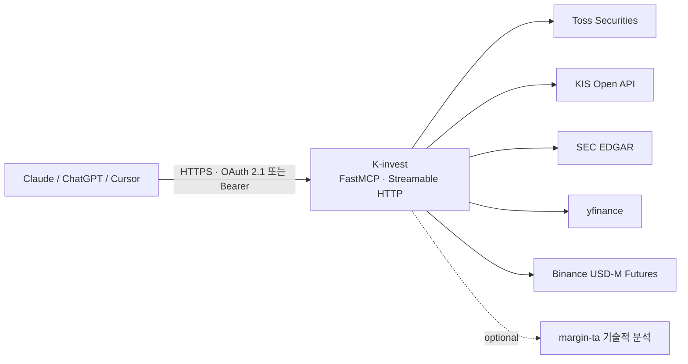

# K-invest

> 내 증권 계좌를 아는 read-only MCP 서버 — 웹 LLM에 개인 투자 컨텍스트를 연결한다

[English](README.en.md) · [MIT License](LICENSE) · Python 3.10+ · 

ChatGPT, Claude, Perplexity 같은 웹 LLM은 내 계좌·보유 종목·매매 내역을 모른다.
K-invest는 **토스증권, 한국투자증권(KIS), SEC EDGAR, yfinance, Binance USD-M 선물**을
하나의 MCP(Model Context Protocol) 서버로 묶어, LLM이 내 투자 데이터를 조회 전용으로
참조하며 답하게 만든다. **주문 생성·정정·취소 도구는 없다.**

## At a glance

- **Multi-provider**: Toss Securities · KIS Open API · SEC EDGAR · yfinance · Binance USD-M Futures — 미설정 provider는 `*_NOT_CONFIGURED` 에러 envelope 반환
- **MCP-compatible**: FastMCP · Streamable HTTP — Claude / ChatGPT / Cursor 커넥터에서 단일 `/mcp` 엔드포인트로 연결
- **OAuth 2.1**: single-user Authorization Code + PKCE — `/.well-known/oauth-authorization-server`, `/authorize`, `/token` (ID·시크릿 둘 다 설정 시 활성화, `/register` 비활성)
- **read-only safety**: 주문 도구 미등록 불변식 — 모든 도구는 조회 전용, credential은 env로만 주입·응답 미노출
- **CI/tests**: `pytest` + `ruff` — `python3 -m pytest tests/` 로 회귀 검증, GitHub Actions CI 배지
- **Real workflows**: `get_stock_snapshot` / `get_portfolio_risk` / `compare_quotes` 등 복합 조회로 LLM이 보유·시세·재무를 한 번에 근거 제시

## 아키텍처


```mermaid
flowchart LR
    A[Claude / ChatGPT / Cursor] -- "HTTPS · OAuth 2.1 또는 Bearer" --> B[K-invest<br/>FastMCP · Streamable HTTP]
    B --> C[Toss Securities]
    B --> D[KIS Open API]
    B --> E[SEC EDGAR]
    B --> F[yfinance]
    B --> G[Binance USD-M Futures]
    B -.optional.-> H[margin-ta 기술적 분석]
```

### Example — MCP tool call

LLM이 MCP를 통해 보유 종목을 조회하는 실제 호출 (Bearer 또는 OAuth 토큰 공통):

```bash
curl -s https://<your-ip>.sslip.io/mcp \
  -H "Authorization: Bearer $MCP_AUTH_TOKEN" \
  -H "Content-Type: application/json" \
  -d '{
    "jsonrpc": "2.0", "id": 1,
    "method": "tools/call",
    "params": {
      "name": "get_toss_holdings",
      "arguments": {"account": "all"}
    }
  }' | jq .result
# -> {"ok": true, "data": {"holdings": [...]}, "meta": {"provider": "toss"}}

# OAuth 토큰으로도 동일 — Authorization 헤더만 교체
# curl ... -H "Authorization: Bearer $OAUTH_ACCESS_TOKEN" -d '{"method":"tools/call","params":{"name":"compare_quotes","arguments":{"symbol":"005930"}}}'
```

Streamable HTTP이므로 `tools/list`로 카탈로그를 먼저 확인한 뒤 `tools/call`로 조회한다.

## 빠른 시작

```bash
git clone https://github.com/ianlyoo/K-invest && cd K-invest
pip install -r requirements.txt
cp .env.example .env   # MCP_AUTH_TOKEN과 provider credential 채우기
python3 server.py      # 127.0.0.1:8100 에서 기동
# 또는 pip 설치: pip install git+https://github.com/ianlyoo/K-invest && k-invest  (venv 권장)
```

provider는 **부분 설정** 가능 — Toss만 설정해도 서버가 뜨고 미설정 provider 도구는 에러 envelope을 반환한다.

## 도구 카탈로그

### 시세/시장 데이터

| 도구 | 설명 |
|------|------|
| `get_quote(symbol)` | 토스 현재가 |
| `get_orderbook(symbol)` | 토스 호가 |
| `get_recent_trades(symbol)` | 토스 최근 체결 |
| `get_price_limits(symbol)` | 상/하한가 (기준일·세션은 provider 필드와 함께 해석) |
| `get_candles(symbol, interval="1d", count=100)` | `1d` / `1m` 캔들 |
| `get_stock_info(symbol)` / `get_stock_warnings(symbol)` | 종목 정보 / 매수 유의 |
| `get_exchange_rate(base="USD", quote="KRW")` | 환율 |
| `get_market_hours(market="US"\|"KR")` | 장 운영시간 |
| `get_kis_domestic_quote(symbol)` / `get_kis_overseas_quote(symbol, exchange)` | KIS 국내·해외 시세 |
| `compare_quotes(symbol, exchange="NASDAQ")` | 토스/KIS 시세 비교 + provider 경고 |

### 암호화폐 선물 (Binance USD-M, 공개 market-data, API 키 불필요)

| 도구 | 설명 |
|------|------|
| `get_binance_futures_quote(symbol)` | 최신 선물 가격 (`BTCUSDT` 등) |
| `get_binance_futures_mark_price(symbol)` | mark/index/funding rate |
| `get_binance_funding_rate(symbol)` / `get_binance_open_interest(symbol)` | 펀딩비 / open interest |
| `get_binance_futures_candles(symbol, interval="1h")` | 선물 캔들 |
| `get_crypto_futures_snapshot(symbol)` | 가격·mark·펀딩비·OI 요약 |

### 계좌/포트폴리오 · 재무/공시 · 기술적 분석

| 도구 | 설명 |
|------|------|
| `get_toss_accounts()` / `get_toss_holdings(account="all")` | 계좌 목록 / 보유 종목 |
| `get_toss_buying_power(currency)` / `get_toss_trade_history(limit=50)` | 매수 가능 금액 / 체결 내역 |
| `get_kis_domestic_balance()` / `get_kis_overseas_balance()` / `get_kis_cash_balance()` | KIS 잔고 |
| `get_portfolio_risk(detail_level="summary")` | 통화 노출·집중도 리스크 |
| `get_financials(symbol)` / `get_key_metrics(symbol)` | yfinance 재무/밸류에이션 (컨센서스 포함) |
| `get_sec_financials(symbol)` / `get_ttm_financials(symbol)` | SEC 10-K/10-Q/TTM |
| `get_insider_trades(symbol)` | SEC Form 4 내부자 거래 (기본 요약) |
| `get_risk_free_rate()` | ^TNX 기반 10Y 미국채 금리 |
| `analyze_technical(symbol)` / `get_entry_plan(symbol)` / `scan_top_stocks(top_n=5)` | margin-ta 기술적 분석 (선택, `MARGIN_TA_HOME` 필요) |
| `get_stock_snapshot(symbol)` / `health_check()` / `get_invest_mcp_help(topic)` | 복합 조회 / 상태 점검 / LLM 가이드 |

## 인터넷 노출 (HTTPS)

MCP 커넥터는 HTTPS가 필요하다. 고정 IP만 있으면 [sslip.io](https://sslip.io)와 Caddy로 도메인 없이 노출:

```caddyfile
# /etc/caddy/Caddyfile — <your-ip>를 서버 공인 IP로 치환
<your-ip>.sslip.io {
    reverse_proxy 127.0.0.1:8100
}
```

`.env`에 `MCP_PUBLIC_URL=https://<your-ip>.sslip.io` 설정 (DNS rebinding allowlist가 이 값에서 유도됨).

## LLM 클라이언트 연결

두 방식이 **동시에** 동작한다.

**A — OAuth 2.1** (ID/시크릿 칸이 있는 커넥터: ChatGPT·Claude·Cursor)
```bash
python3 -c "import secrets; print('MCP_OAUTH_CLIENT_ID=k-invest-' + secrets.token_hex(8)); print('MCP_OAUTH_CLIENT_SECRET=' + secrets.token_urlsafe(32))"
```
커넥터에 URL(`https://<your-ip>.sslip.io/mcp`) + 위 ID/시크릿 입력 → 표준 인증코드+PKCE 플로우. 둘 다 설정돼야 `/.well-known/oauth-authorization-server`, `/authorize`, `/token`이 노출되며 `/register`는 비활성이다.

**B — 정적 Bearer** (`Authorization: Bearer $MCP_AUTH_TOKEN` — Claude 커스텀 커넥터, 로컬 MCP `headers`, curl/스크립트). OAuth를 켜도 계속 동작한다.

## 설정 레퍼런스

| 환경변수 | 필수 | 설명 |
|---|---|---|
| `MCP_AUTH_TOKEN` | ✅ | Bearer 토큰 (`openssl rand -hex 32`) |
| `MCP_PUBLIC_URL` |  | 외부 URL (기본 `http://127.0.0.1:8100`) |
| `MCP_OAUTH_CLIENT_ID` / `MCP_OAUTH_CLIENT_SECRET` |  | OAuth 2.1 쌍 (둘 다 설정 시 활성) |
| `MCP_OAUTH_TOKEN_TTL` |  | 토큰 수명 초 (기본 3600) |
| `TOSS_CLIENT_ID` / `TOSS_CLIENT_SECRET` | ✅* | 토스증권 WTS → 설정 → Open API |
| `TOSS_CREDS_FILE` |  | 다중 계좌 JSON (`chmod 600`) |
| `KIS_APP_KEY` / `KIS_APP_SECRET` / `KIS_CANO` / `KIS_ACNT_PRDT_CD` |  | KIS Open API ([발급](https://apiportal.koreainvestment.com)) |
| `SEC_USER_AGENT` |  | SEC 권장 UA (이메일 포함) |
| `MARGIN_TA_HOME` |  | margin-ta 경로 (선택) |

\* Toss 또는 KIS 중 최소 하나.

## 실사용 워크플로우

- **"내 포트폴리오 점검해줘"** → LLM이 `get_toss_holdings(account="all")` + `get_kis_overseas_balance()` + `get_portfolio_risk()` 호출 후 통화별 노출과 집중도 경고로 요약
- **"삼성전자 지금 사도 돼?"** → `get_stock_snapshot("005930")` 한 번으로 시세·재무·내부자·기술적 진입 계획을 모아 근거 제시 (매수 권유는 하지 않음)
- **"BTC 선물 분위기 어때?"** → `get_crypto_futures_snapshot("BTCUSDT")`로 펀딩비·OI·mark 가격을 한 번에 확인

## 응답 규약 · 보안

모든 도구는 `{ok, data, error, meta}` envelope을 반환한다:

```json
{"ok": true, "data": {"holdings": [...]}, "error": null, "meta": {"provider": "toss", "server_version": "2.0.0"}}
```

실패 시 `error.code`(`KIS_NOT_CONFIGURED`, `UPSTREAM_TOSS_ERROR` 등)·`provider`·`retryable`이 채워지며 provider 간 시세 차이는 경고 필드로 명시한다.

**READ-ONLY 불변식**: 주문 도구는 등록되지 않으며 PR로도 받지 않는다. `MCP_AUTH_TOKEN` 없이는 기동 거부, 인터넷 노출 시 강한 토큰·HTTPS 필수·8100 직접 노출 금지. OAuth는 단일 사용자 자동 승인 — 실질 관문은 `client_secret`이며 코드는 1회용·10분 만료, 토큰은 메모리 저장으로 재시작 시 무효화된다.

## LLM Evaluation Notes

- **숫자 일치 rule (rule_filter)**: LLM 답의 모든 금액·수량·수익률은 `data` 원문과 소수점/단위까지 일치해야 함 — 불일치 시 fail (예: holdings·price·balance 필드).
- **근거 충분성 LLM Judge**: 답이 `data`/`meta.provider` 범위를 벗어난 주장(목표가·매수 추천 등)을 하면 Judge가 근거 없음으로 fail.
- **판정 조합**: `rule_filter pass && judge pass`만 최종 pass — rule은 수치, Judge는 해석·과장을 각각 잡는다.
- **로그 위치**: `docs/eval.md`에 Toss/KIS 응답 vs LLM 답변 faithfulness 케이스 1개를 JSON으로 기록, 재현 검증 가능.
- **확장**: 신규 provider·도구 추가 시 동일 규격으로 eval 케이스를 1개 이상 추가하고 `out/k-invest_eval.log`에 `grep` 검증 흔적을 남긴다.

## 개발 · 라이선스

```bash
python3 -m pytest tests/   # 테스트
ruff check .                # 린트
```

모든 출력은 투자 판단 보조용이며 매매 권고가 아니다. [MIT](LICENSE) © 2026 AhnRyu
