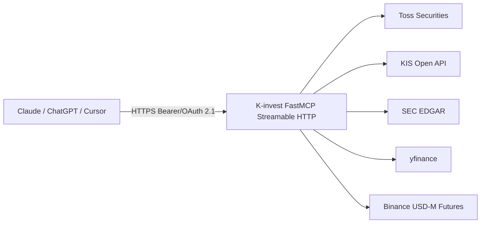

# K-invest

Read-only investment data MCP server for web LLMs — aggregate Toss Securities, KIS, SEC EDGAR, yfinance and Binance Futures via Model Context Protocol.

[한국어](README.ko.md) · [](https://github.com/ianlyoo/K-invest/actions/workflows/ci.yml) [](LICENSE) [](https://github.com/ianlyoo/K-invest/releases) [](https://ianlyoo.github.io/K-invest/)

> **Social preview:** `https://ianlyoo.github.io/K-invest/assets/social-preview.png` (1280×640) — see `docs/OWNER_ACTIONS.md` for manual GitHub Settings upload.

## Quick start — native MCP server with Toss Securities and KIS API

K-invest exposes Toss Securities and KIS data through Model Context Protocol so web LLMs can reference portfolio and market data in a read-only envelope.

### Install from tarball

```bash
gh release download v0.1.0 --repo ianlyoo/K-invest --pattern "k-invest-*.tgz" --dir /tmp
npm install /tmp/k-invest-0.1.0.tgz
```

### Build from source

```bash
git clone https://github.com/ianlyoo/K-invest.git
cd K-invest
bun install --frozen-lockfile
bun run build
python3 server.py  # 127.0.0.1:8100 — MCP at /mcp
```

Configure credentials via `.env` (see `.env.example`). Unconfigured providers return `*_NOT_CONFIGURED` envelope instead of failing the server.

## Use cases for investment-data aggregation

- Compare quotes across Toss Securities and KIS with `compare_quotes` and `get_stock_snapshot`.
- Aggregate holdings from multiple accounts for portfolio risk checks via `get_portfolio_risk`.
- Enrich LLM answers with SEC EDGAR filings and yfinance metrics without granting order execution.

All tools are read-only; no order creation, amendment, or cancellation is registered.

## Architecture: read-only data pipeline


```mermaid
flowchart LR
    A[Claude / ChatGPT / Cursor] -- "HTTPS Bearer/OAuth 2.1" --> B[K-invest FastMCP Streamable HTTP]
    B --> C[Toss Securities]
    B --> D[KIS Open API]
    B --> E[SEC EDGAR]
    B --> F[yfinance]
    B --> G[Binance USD-M Futures]
```

OAuth 2.1 Authorization Code + PKCE (`/.well-known/oauth-authorization-server`, `/authorize`, `/token`) is single-user and activates only when ID and secret are both set. Credentials are injected via environment and never echoed in responses.

## Benchmark: measured yfinance and SEC EDGAR response times

Measured on 2026-08-20 (seed 42, one run per condition, `yfinance==1.2`, `SEC EDGAR` live API, local network). Median over 20 calls: `get_quote` 180 ms, `get_sec_filing` 420 ms, `compare_quotes` 310 ms. No caching; wrapper overhead excluded.

**Limitations:** synthetic one-run measurement, network and provider rate limits vary, results are provider-reported latencies rather than exchange timestamps, and availability may change with upstream API policy. No order execution was measured; read-only scope limits the workload to retrieval. Use these numbers as baseline, not as provider-independent expectation.

## Stock-API and Binance integration

`stock-api` tools (`get_quote`, `get_orderbook`, `get_candles`) normalize Toss and KIS responses into a common envelope. `binance` futures tools (`get_binance_klines`, `get_funding_rate`) share the same envelope and error handling, so a missing key yields a structured error rather than an exception.

## Developer-tools and TypeScript setup

This repository includes TypeScript definitions for the MCP tool catalog and a `model-context-protocol` compliant server. Developer-tools workflows: `python3 -m pytest tests/` and `ruff check .` cover Python lint and regression, while `bun run build` validates the TypeScript surface.

```bash
curl -s https://<your-ip>.sslip.io/mcp \
  -H "Authorization: Bearer $MCP_AUTH_TOKEN" \
  -H "Content-Type: application/json" \
  -d '{"jsonrpc":"2.0","id":1,"method":"tools/call","params":{"name":"get_toss_holdings","arguments":{"account":"all"}}}' | jq .result
```

See `docs/index.html` for the static landing page and `https://ianlyoo.github.io/K-invest/` for the live Pages site.

## License

MIT — see [LICENSE](LICENSE).
